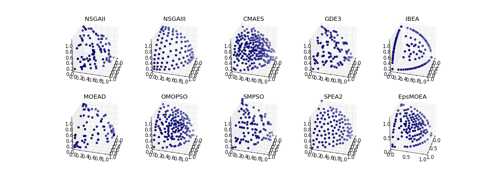

============
Experimenter
============

There are several common scenarios encountered when experimenting with MOEAs:

1. Testing a new algorithm against many test problems
2. Comparing the performance of many algorithms across one or more problems
3. Testing the effects of different parameters

Platypus provides the ``experimenter`` module with convenient routines for
performing these kinds of experiments.  Furthermore, the experimenter methods
all support parallelization.

Basic Use
---------

Suppose we want to compare NSGA-II and NSGA-III on the DTLZ2 problem.  In
general, you will want to run each algorithm several times on the problem
with different random number generator seeds.  Instead of having to write
many for loops to run each algorithm for every seed, we can use the 
``experiment`` function.  The experiment function accepts a list of algorithms,
a list of problems, and several other arguments that configure the experiment,
such as the number of seeds and number of function evaluations.  It then
evaluates every algorithm against every problem and returns the data in a
JSON-like dictionary.

Afterwards, we can use the ``calculate`` function to calculate one or more
performance indicators for the results.  The result is another JSON-like
dictionary storing the numeric indicator values.  We finish by pretty printing
the results using ``display``.

.. literalinclude:: ../examples/experimenter.py
   :language: python
        
The output of which appears similar to:

.. code::

    NSGAII
        DTLZ2
            Hypervolume : [0.361, 0.369, 0.372, 0.376, 0.376, 0.388, 0.378, 0.371, 0.363, 0.364]
    NSGAIII
        DTLZ2
            Hypervolume : [0.407, 0.41, 0.407, 0.405, 0.405, 0.398, 0.404, 0.406, 0.408, 0.401]

Once this data is collected, we can then use statistical tests to determine if
there is any statistical difference between the results.  In this case, we
may want to use the Mann-Whitney U test from ``scipy.stats.mannwhitneyu``.

Note how we listed the algorithms: ``[NSGAII, (NSGAIII, {"divisions_outer":12})]``.
Normally you just need to provide the algorithm type, but if you want to
customize the algorithm, you can also provide optional arguments.  To do so,
you need to pass a tuple with the values ``(type, dict)``, where dict is a
dictionary containing the arguments.  If you want to test the same algorithm
with different parameters, pass in a three-element tuple containing
``(type, dict, name)``.  The name element provides a custom name for the
algorithm that will appear in the output.  For example, we could use
``(NSGAIII, {"divisions_outer":24}, "NSGAIII_24")``.  The names must be unique.
        
Parallelization
---------------

One of the major advantages to using the experimenter is that it supports
parallelization.  In Python, there are several standards for running parallel
jobs, such as the map function.  Platypus abstracts these different standards
using the ``Evaluator`` class.  The default evaluator is the ``MapEvaluator``,
but parallel versions such as ``MultiprocessingEvaluator`` for Python 2 and
``ProcessPoolEvaluator`` for Python 3.

When using these evaluators, one must also follow any requirements of the
underlying library.  For example, ``MultiprocessingEvaluator`` uses the
``multiprocessing`` module available on Python 2, which requires the users to
invoke ``freeze_support()`` first.
        
.. literalinclude:: ../examples/experimenter_parallel.py
   :language: python

Comparing Algorithms Visually
-----------------------------

Extending the previous examples, we can perform a full comparison of all
supported algorithms on the DTLZ2 problem and display the results visually.
Note that several algorithms, such as NSGA-III, CMAES, OMOPSO, and EpsMOEA,
require additional parameters.

.. literalinclude:: ../examples/comparison.py
   :language: python

Running this script produces the figure below:

   