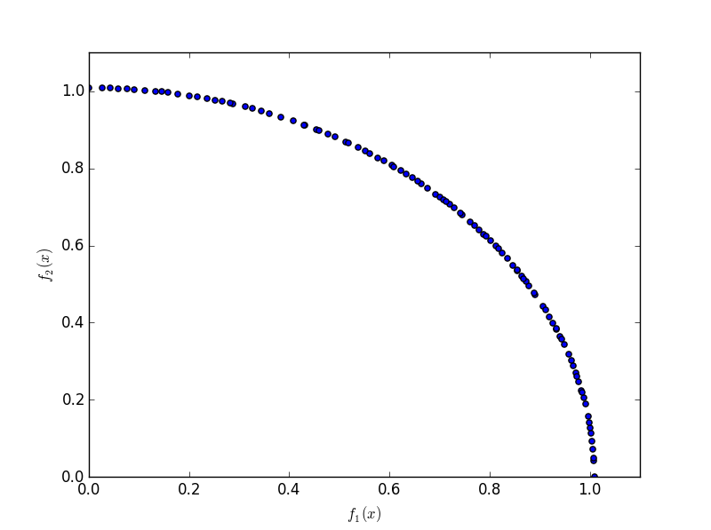

===============
Getting Started
===============

Installing Platypus
-------------------
    
To install the latest development version of Platypus, run the following
commands.  Note that Platypus is under active development, and as such may
contain bugs.

::

    git clone https://github.com/Project-Platypus/Platypus.git
    cd Platypus
    python setup.py develop

A Simple Example
----------------

As an initial example, we will solve the well-known two objective DTLZ2 problem
using the NSGA-II algorithm:

.. code:: python

    from platypus.algorithms import NSGAII
    from platypus.problems import DTLZ2

    # define the problem definition
    problem = DTLZ2()

    # instantiate the optimization algorithm
    algorithm = NSGAII(problem)
    
    # optimize the problem using 10,000 function evaluations
    algorithm.run(10000)

    # display the results
    for solution in algorithm.result:
       print solution.objectives
       
The output shows on each line the objectives for a Pareto optimal solution:

.. code::

    [1.00289403128, 6.63772921439e-05]
    [0.000320076737668, 1.00499316652]
    [1.00289403128, 6.63772921439e-05]
    [0.705383878891, 0.712701387377]
    [0.961083112366, 0.285860932437]
    [0.729124908607, 0.688608373855]
    ...
      
If *matplotlib* is available, we can also plot the results.  Note that
*matplotlib* must be installed separately.  Running the following code

.. code:: python

    import matplotlib.pyplot as plt
    
    plt.scatter([s.objectives[0] for s in algorithm.result],
                [s.objectives[1] for s in algorithm.result])
    plt.xlim([0, 1.1])
    plt.ylim([0, 1.1])
    plt.xlabel("$f_1(x)$")
    plt.ylabel("$f_2(x)$")
    plt.show()
    
produce a plot similar to:
    

    
Note that we did not need to specify many settings when constructing NSGA-II.
For any options not specified by the user, Platypus supplies the appropriate
settings using best practices.  In this example, Platypus inspected the
problem definition to determine that the DTLZ2 problem consists of real-valued
decision variables and selected the Simulated Binary Crossover (SBX) and
Polynomial Mutation (PM) operators.  One can easily switch to using different
operators, such as Parent-Centric Crossover (PCX):

.. code:: python

    from platypus.algorithms import NSGAII
    from platypus.problems import DTLZ2
    from platypus.operators import PCX

    problem = DTLZ2()

    algorithm = NSGAII(problem, variator = PCX())
    algorithm.run(10000)
    
Defining Unconstrained Problems
-------------------------------

There are several ways to define problems in Platypus, but all revolve around
the ``Problem`` class.  For unconstrained problems, the problem is defined
by a function that accepts a single argument, a list of decision variables,
and returns a list of objective values.  For example, the bi-objective,
Schaffer problem, defined by

.. math::

    \text{minimize } (x^2, (x-2)^2) \text{ for } x \in [-10, 10]
    
can be programmed as follows:

.. code:: python

    from platypus.algorithms import NSGAII
    from platypus.core import Problem
    from platypus.types import Real

    def schaffer(x):
       return [x[0]**2, (x[0]-2)**2]

    problem = Problem(1, 2)
    problem.types[:] = Real(-10, 10)
    problem.function = schaffer

When creating the ``Problem`` class, we provide two arguments: the number
if decision variables, ``1``, and the number of objectives, ``2``.  Next, we
specify the types of the decision variables.  In this case, we use a real-valued
variable bounded between -10 and 10.  Finally, we define the function for
evaluating the problem.

**Tip:** The notation ``problem.types[:]`` is a shorthand way to assign all
decision variables to the same type.  This is using Python's slice notation.
You can also assign the type of a single decision variable, such as
``problem.types[0]``, or any subset, such as ``problem.types[1:]``.

An equivalent but more reusable way to define this problem is extending the
``Problem`` class.  The types are defined in the ``__init__`` method, and the
actual evaluation is performed in the ``evaluate`` method.

.. code:: python

    from platypus.algorithms import NSGAII
    from platypus.core import Problem, evaluator
    from platypus.types import Real

    class Schaffer(Problem):
    
        def __init__(self):
            super(Schaffer, self).__init__(1, 2)
            self.types[:] = Real(-10, 10)
        
        @evaluator
        def evaluate(self, solution):
            x = solution.variables[:]
            solution.objectives[:] = [x[0]**2, (x[0]-2)**2]

    algorithm = NSGAII(Schaffer())
    algorithm.run(10000)
    
Note that the ``evaluate`` method is decorated by ``@evaluator``.  It is
important to use this decoration when extending the ``Problem`` class,
otherwise certain required attributes of a solution will not be computed.

Defining Constrained Problems
-----------------------------
    
Constrained problems are defined similarly, but must provide two additional
pieces of information.  First, they must compute the constraint value (or values
if the problem defines more than one constraint).  Second, they must specify
when constraint is feasible and infeasible.  To demonstrate this, we will use
the Belegundu problem, defined by:

.. math::

    \text{minimize } (-2x+y, 2x+y) \text{ subject to } y-x \leq 1 \text{ and } x+y \leq 7
    
This problem has two inequality constraints.  We first simplify the constraints
by moving the constant to the left of the inequality.  The resulting formulation
is:

.. math::

    \text{minimize } (-2x+y, 2x+y) \text{ subject to } y-x-1 \leq 0 \text{ and } x+y-7 \leq 0

Then, we program this problem within Platypus as follows:

.. code:: python

    from platypus.core import Problem
    from platypus.types import Real

    def belegundu(vars):
        x = vars[0]
        y = vars[1]
        return [-2*x + y, 2*x + y], [-x + y - 1, x + y - 7]

    problem = Problem(2, 2, 2)
    problem.types[:] = [Real(0, 5), Real(0, 3)]
    problem.constraints[:] = "<=0"
    problem.function = belegundu
    
First, we call ``Problem(2, 2, 2)`` to create a problem with two decision
variables, two objectives, and two constraints, respectively.  Next, we set the
decision variable types and the constraint feasibility criteria.  The constraint
feasibility criteria is specified as the string ``"<=0"``, meaning a
solution is feasible if the constraint values are less than or equal to zero.
Platypus is flexible in how constraints are defined, and can include inequality
and equality constraints such as ``">=0"``, ``"==0"``, or ``"!=5"``.  Finally,
we set the evaluation function.  Note how the ``belegundu`` function returns
a tuple (two lists) for the objectives and constraints.

Alternatively, we can develop a reusable class for this problem by extending
the ``Problem`` class.  Like before, we move the type and constraint
declarations to the ``__init__`` method and assign the solution's
``constraints`` attribute in the ``evaluate`` method.

.. code:: python

    from platypus.core import Problem, evaluator
    from platypus.types import Real

    class Belegundu(Problem):
    
        def __init__(self):
            super(Belegundu, self).__init__(2, 2, 2)
            self.types[:] = [Real(0, 5), Real(0, 3)]
            self.constraints[:] = "<=0"
        
        @evaluator
        def evaluate(self, solution):
            x = solution.variables[0]
            y = solution.variables[1]
            solution.objectives[:] = [-2*x + y, 2*x + y]
            solution.constraints[:] = [-x + y - 1, x + y - 7]
    
In these examples, we have assumed that the objectives are being minimized.
Platypus is flexible and allows the optimization direction to be changed per
objective by setting the ``directions`` attribute.  For example:

.. code:: python

    problem.directions[:] = Problem.MAXIMIZE
    
